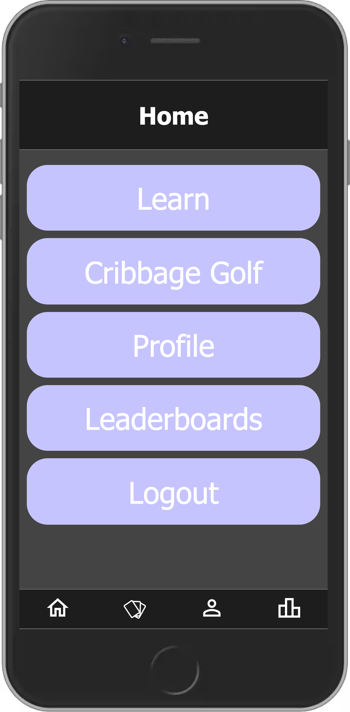

<!--  -->
# Cribbage Trainer

♥️♠️ <a href="http://cribbagetrainer.herokuapp.com">Try the App</a> ♣️♦️

(optimized for mobile)

## Description
**Duration:** _2 week sprint_

An full-stack, full CRUD web application for Cribbage Players of all skill levels to learn cribbage hand scoring and practice making informed gameplay decisions through interactive tutorials, game modes, direct feedback, and statistics.

Features include a main challenge mode, a tutorial in hand scoring for beginners, and personal and public high score tracking.

Upon logging in to the app, the user is presented with a home screen, from which they can navigate throughout the app.

  

Tapping the **Learn** button takes the user to the tutorial, in which the user is presented with a series of screens explaining a single scoring technique or quirk of the game, and tasked with using that knowledge to find all the card combinations that can be scored in that hand. The tutorials walk through every method of scoring, as well as 

The primary challenge mode, titled **Cribbage Golf**, is a game in which the user is presented six random playing cards, and asked to choose to keep the best hand of four cards, disregarding the crib. Every scoring possibility of those four cards and every possible random card chosen from the deck, and an average score is assigned. The app also calculates the average score of every other possible hand the user could have chosen, and evaluates the user based on how close to statistically optimal their choice was. If the user did not choose the best hand, both their chosen hand and the best hand are presented for comparison. Additional statistics including the minimum possible, maximum possible, and average points for both hands are available in a optionally-displayed histogram.

## Prerequisites

- Node.js
- PostgreSQL

## Usage

1. Navigate to [cribbagetrainer.herokuapp.com](http://cribbagetrainer.herokuapp.com) or follow the installation instructions below
2. Log In to an existing account, or register a new one.
3. Choose a mode - Learn (for beginners) or Cribbage Golf (challenge mode)
4. Learn Mode: Follow the onscreen prompts to learn the rules of Cribbage scoring and progress. Tap cards to select scoring combinations, the question mark icon to review the scoring and current goals, and items on the list of already found scores to highlight the cards that comprise them.
5. Cribbage Golf: Complete 10 rounds to record your personal score and post it to the leaderboards. Tap the question mark icon to review the rules, and the 'Show Chart' button (when prompted) to view a chart with more information. Lower score is better!
6. From the home screen or bottom nav bar, visit the Leaderboards page to view the best global scores.
7. From the home screen or bottom nav bar, visit the Profile page to view personal scores, update display name, log out, or delete account.

## Installation

1. Fork and clone repo
2. Initialize the database with the code from `database.sql`
3. In the terminal: `npm install`
4. `npm run server`
5. `npm run client` to automatically launch the app in a browser

## Support

Please feel free to email me at rutherford.t.b@gmail.com with any comments or suggestions! I'd love to hear your thoughts :)

## Acknowledgements

Thanks to my instructors and peers at Prime Digital Academy, who have supported me in my growth as a Software Developer!